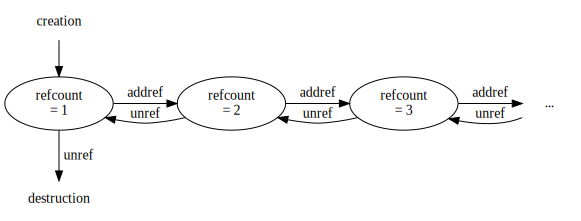
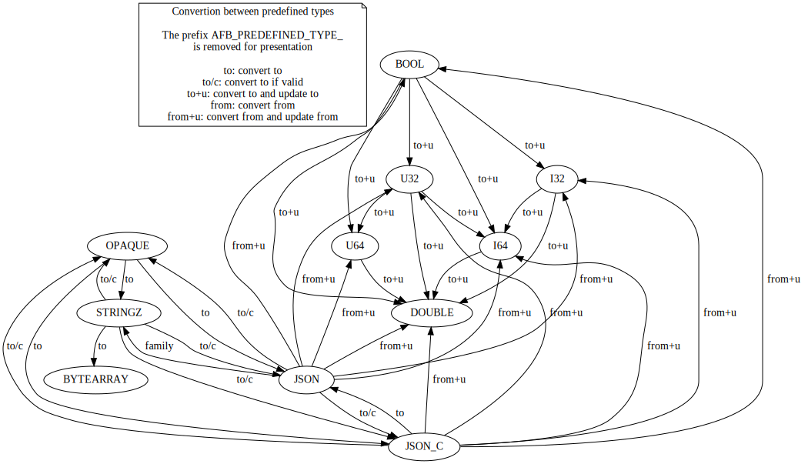

# Handling data in bindings

Since version 4, **afb-binding** has introduced the types `afb_data_t`
and `afb_type_t` to handle any kind of data.

The reason of introducing these new types is to allow invocation
of procedures with any data type.

An important design decision is that the framework AFB can ignore
anything of the data it transports between clients and services.

## Basis of data

The type `afb_data_t` is a pointer to an opaque structure defined as below:

```
typedef struct afb_data *afb_data_t;
```

So, the real data can not be accessed directly but through functions.
The functions for accessing the real data are:

- `afb_data_type`: get the type of the data
- `afb_data_size`: get the size of the data
- `afb_data_ro_pointer`: get a read only pointer to the data
- `afb_data_rw_pointer`: get a read/write pointer to the data
- `afb_data_get_constant`: get a read only pointer to the data, its size and a status
- `afb_data_get_mutable`: get a read/write pointer to the data, its size and a status

The 3 important characteristics of the data are its type, its address, its size.

### The type of the data

As for programming languages, the types summarize the characteristics of a data.
It means that all the data of a specific type have the same set of characteristics.
As an example, the predefined type `AFB_PREDEFINED_TYPE_U32` refers to addresses of
unsigned integers of 32 bits so of 4 bytes size.

Types are described more deeply below.

### The address of the data

The address of the data is the location in memory where the data live.
Addresses are presented as pointers either only readable or readable and writable.

### The size of the data

The size is used for many types to indicates the real size of the data in memory.

But for some types, the size of the data is not used because of one of the following reasons:
it is unknown, it is well known, it does not care. Int that cases the size can be set to zero.
As example, for the predefined type `AFB_PREDEFINED_TYPE_JSON_C` defines the data pointer
as being a pointer of type `struct json_object *` whose size is unknown, the size is unused
and should be set to zero.

## Live cycle of data

The data are reference counted. At creation, their reference count is 1. The function
`afb_data_addref` increments the reference count of the data by one unit. The function
`afb_data_unref` decrements the reference count of one unit and if the reference count
falls to the value zero, the data is automatically destroyed and its used memory is
released.



### Creation of data

There are 3 functions for creating instances of data:

- `afb_create_data_raw`: the most basic creation function but it has the advantage of being
  able to track the destruction of the data when itsd reference count falls to 0.
- `afb_create_data_alloc`: it just allocates the memory initialized
  with zeros and records how to free it.
- `afb_create_data_copy`: it is like the function *afb_create_data_alloc* but instead of
  initializing the memory with zeros, it copies a given value.

The functions *afb_create_data_alloc* and *afb_create_data_copy* are basic helpers
aound the primitive function *afb_create_data_raw* that is declared as below:

```c
int
afb_create_data_raw(
	afb_data_t *data,            /* pointer for receiving the created data    */
	afb_type_t  type,            /* type    of the created data               */
	const void *pointer,         /* pointer of the created data               */
	size_t      size,            /* size    of the created data               */
	void      (*dispose)(void*), /* a function to call when data is destroyed */
	void       *closure          /* the parameter to pass to function dispose */
);
```

On error, the function returns a negative value.

On success, that function returns zero and creates the data whose 3 important
characteristics are the one given as parameter: *type*, *pointer*, *size*.

If the parameter *dispose* is not NULL, it must be a function that takes only one
parameter of type `void *`. That function is called with the argument *closure* at
the end of the life of the data to destroy it. For convenience, it is also called
if the creation of the data fails.

### example: the function afb_create_data_copy

Here is how could be defined the function *afb_create_data_copy*:

```c
int
afb_create_data_copy(
	afb_data_t *data,
	afb_type_t type,
	const void *buffer,
	size_t size
) {
	void *pointer = malloc(size);
	if (pointer == NULL)
		return AFB_ERRNO_OUT_OF_MEMORY;
	memcpy(pointer, buffer, size);
	return afb_create_data_raw(data, type, pointer, size, free, pointer);
}
```

If the call to *afb_create_data_raw* fails, the function free is automatically
called with the pointer.

### example: creating data linked to an other object

An important property is that the given closure can be the given pointer or
not. This allows to create data that are part of something else.

In this example, we create a JSON string data representing a json object:

```c
int str_data_of_jsonc(afb_data *data, json_object *jso)
{
	const char *str = json_object_to_json_string(jso);
	return afb_create_data_raw(data,
	                  AFB_PREDEFINED_TYPE_JSON, str, 1+strlen(str),
			  json_object_put, json_object_get(jso));
}
```

This uses the fact that json-c keeps the JSON string representation inside
the JSON object until the object is released.

### creation of subdata or data linked to other data

Caution as to be taken when a data is created that depend of an other data.
In that case, it is required to explicit the dependency to the framework
in order to ensure that the data remain lively as needed.

This is achieved using the functions below:

- *afb_data_dependency_add*: adds a dependency from one data to another
- *afb_data_dependency_sub*: removes a previously added dependency
- *afb_data_dependency_drop_all*: drops all the dependency of a data

## Basis of data types

The data are created with a type. The type of a data tells how to interpret
the pointer and size values of the data. For example the pointer of a data
of type *AFB\_PREDEFINED\_TYPE\_STRINGZ* is a unicode string terminated with
the nul character.

The type framework is used for also for the transfering data during remote procedure
calls, for converting and updating data from one type to an other.

### creation of types

A type can be created using the function *afb_type_register*.

```c
int
afb_type_register(
	afb_type_t *type,      /* resulting registered type   */
	const char *name,      /* registered name of the type */
	afb_type_flags_t flags /* characteristics of the type */
);
```

This creates a type of the given name and characteristics.
Names starting with the character `#` are reserved for predefined types.

The possible characteristics are given by *flags* using a bitwise or
of the values below:

- *Afb_Type_Flags_Shareable*: Data of that type can be shared through memory
- *Afb_Type_Flags_Streamable*: Data of that type can be streamed
- *Afb_Type_Flags_Opaque*: Data of that type can be represented with an opaaque handler

When the data is transmitted in remote procedure call, its opaque handler or its content if
streamable is transmitted as well as its type name. The type's name must be unique.

### predefined types

The predefined types are:

| type name  | C macro name                     | description                                            |
|------------|----------------------------------|--------------------------------------------------------|
| #opaque    | AFB\_PREDEFINED\_TYPE\_OPAQUE    | The opaque type is anything represented by its address |
| #stringz   | AFB\_PREDEFINED\_TYPE\_STRINGZ   | Type of zero terminated string                         |
| #json      | AFB\_PREDEFINED\_TYPE\_JSON      | Type of json string terminated by a zero               |
| #json_c    | AFB\_PREDEFINED\_TYPE\_JSON\_C   | Type of json object as handled by libjson-c            |
| #bytearray | AFB\_PREDEFINED\_TYPE\_BYTEARRAY | Type for arrays of bytes                               |
| #bool      | AFB\_PREDEFINED\_TYPE\_BOOL      | Type of boolean values                                 |
| #i32       | AFB\_PREDEFINED\_TYPE\_I32       | Type of signed 32 bit integers                         |
| #u32       | AFB\_PREDEFINED\_TYPE\_U32       | Type of unsigned 32 bit integers                       |
| #i64       | AFB\_PREDEFINED\_TYPE\_I64       | Type of signed 64 bit integers                         |
| #u64       | AFB\_PREDEFINED\_TYPE\_U64       | Type of unsigned 64 bit integers                       |
| #double    | AFB\_PREDEFINED\_TYPE\_DOUBLE    | Type of doubles                                        |

For more details, check the specific documentation about predefined types.

### type family

A type can be a kind of an other type. In the predefined type, the only example
is given by *AFB\_PREDEFINED\_TYPE\_JSON* that is of the family *AFB\_PREDEFINED\_TYPE\_STRINGZ*.

It means that any instance of *AFB\_PREDEFINED\_TYPE\_JSON* is also an instance of
*AFB\_PREDEFINED\_TYPE\_STRINGZ*. The opposite is not true because not any string
is a valid JSON string.

It is possible to set the family of a type using the function *afb_type_set_family*.

### converters and updaters

It is possible for a type to define procedure for converting its data instance to or from
an other type. For example, the type *AFB\_PREDEFINED\_TYPE\_I32* converts any of its
instances to *AFB\_PREDEFINED\_TYPE\_I64*.

It is possible to register converters to/from types using the functions *afb_type_add_convert_to*
and *afb_type_add_convert_from*.

The conversion returns a new data instance of data.

Updaters are like converters but instead of returning a new data instance, it
updates an existing data instance.
It is possible to register updaters to/from types using the functions *afb_type_add_update_to*
and *afb_type_add_update_from*.

## assigning and updating value

The framework offers two functions for setting values of data from an other data:

- *afb_data_assign*: This basic function replace a data by an other data.

- *afb_data_update*: This function changes the value of the updated data
  using an updating function. There is no conversion of type except if
  an update function exists.

## Converting data from one type to another

The framework offers two functions for automatic conversion
of data:

- *afb_data_convert*: converts (if possible) a data to the given type.
  This is an explicit conversion. If the data is already of the required
  type, no conversion is needed.

- *afb_req_param_convert*: converts (if possible) the ith data parameter
  of the request to a data of the given type and return it.
  The returned data replace the parameter and is released when the request
  is released.

conversions of predefined types are shown in the figure below:



Once a data is converted, it is silently linked to the original value
for the purpose of avoiding a new conversion in case the same conversion
is later required. If the original value changes, these links can be
removed using the function *afb_data_notify_changed*.

## properties of data

Here the 2 properties of data:

- **constant**: a data is constant if its value can not be changed
- **volatile**: a data is volatile if its value can change at any time,
  without calling the data function for changing the value.

A constant data will always return NULL as result of invoking functions
*afb_data_rw_pointer* and *afb_data_get_mutable*.

A volatile data will never cache the converted values. conversion of value is
documented below.

The property **constant** is managed with the functions below:

- *afb_data_is_constant*: test if a dathas the constant property
- *afb_data_set_constant*: set the constant property of the data
- *afb_data_set_not_constant*: unset the constant property of the data

The property **volatile** is managed with the functions below:

- *afb_data_is_volatile*: test if a dathas the volatile property
- *afb_data_set_volatile*: set the volatile property of the data
- *afb_data_set_not_volatile*: unset the volatile property of the data

## managing access to data

Access to data in reading or writing can be controled using the functions
below that implement a simple reader/writer exclusion mechanism:

- *afb_data_lock_read*: block until the data is locked for read but not write
- *afb_data_try_lock_read*: same as *afb_data_lock_read* but does not block
- *afb_data_lock_write*: block until the data is locked for write and read
- *afb_data_try_lock_write*: same as *afb_data_lock_write* but does not block
- *afb_data_unlock*: unlock the currently locked data

