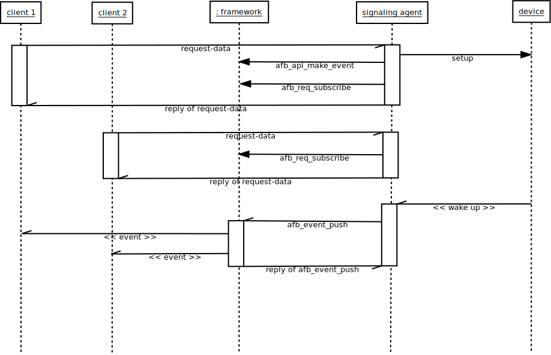

# Guide for developing with events

Signaling agents are services that send events to any clients that
has subscribed to receive them.
The events sent can carry any payload data.

## Overview of events

For people familiar with the framework, a signaling agent is
commonly a “binding”.

Signaling agents invoke the framework to create 'event' objects.
An event object has:

- a name: the name of the event
- a list of subscribers: the list of clients that subscribed to the event.

The signaling agent:

- creates event objects, giving their name
- adds or removes clients subscribers of its event objects
- push data (even empty data) to the subscribers of event object at any time

These basis are summarized on the following figure:



This figure shows the main role of the signaling framework for the events
propagation.

### Subscribing and unsubscribing

Subscribing is the action that makes a client able to receive
data from a signaling agent.

Subscription must :

1. Create resources for generating the data.
1. Deliver the data to the client.

These two aspects are not handled by the same piece of software.

1. Generating the data is the responsibility of the developer of the signaling agent
1. Delivering the data is handled by the framework.

When a client subscribes for data, the agent must:

1. Check that the subscription request is correct.
1. Establish the computation chain of the required data (if not already done).
1. Create a named event for the computed data (if not already done).
1. Ask the framework to establish the subscription to the event for the client identified by its querying request.
1. Optionally give indications about the event in the reply to the client.

The first two steps do not involve the framework.
They are linked to the business logic of the binding.
The request can be any description of the requested data
and the computing stream can be of any nature,
this is specific to the binding.

Steps 3 and 4 are bound to the framework.

The agent must create an object for handling the propagation of produced
data to its clients.
That object is called “event” in the framework.
An event has a name that allows clients to distinguish it from other
events.

Events are created using the ***afb\_api\_make\_event*** function
that takes the api that creates the event and the name of the event.
Example:

```C
    event = afb_api_make_event(api, name);
```

Once created, the event can be used either to push data to its
subscribers or to broadcast data to any listener.

The event must be used to establish the subscription for the requesting
client.
This is done using the ***afb\_req\_subscribe*** function
that takes the current request object and event and associates them
together.
Example:

```C
    rc = afb_req_subscribe(req, event);
```

When successful, this function make the connection between the event and
the client that emitted the request.
The client becomes a subscriber of the event until it unsubscribes or disconnects.
The ***afb\_req\_subscribe*** function will fail:

- if the client connection is weak.
- if the request comes from a HTTP link.

To receive signals, the client must be connected.

The AGL framework allows connections using WebSocket.

The name of the event is either a well known name or an ad hoc name
forged for the use case.

Let's see a basic example:

- client A expects to receive the speed in km/h every second.
- client B expects the speed in mph twice a second.

In that case, there are two different events because it is not the same
unit and it is not the same frequency.
Having two different events allows to associate clients to the correct event.
But this doesn't tell any word about the name of these events.
The designer of the signaling agent has two options for naming:

1. names can be the same (“speed” for example) with sent data
  self describing itself or having a specific tag (requiring from
  clients awareness about requesting both kinds of speed isn't safe).
1. names of the event include the variations (by example:
  “speed-km/h-1Hz” and “speed-mph-2Hz”) and, in that case, sent data
  can self describe itself or not.

In both cases, the signaling agent might have to send the name of the
event and/or an associated tag to its client in the reply of the
subscription.
This is part of the step 5 above.

The framework only uses the event (not its name) for:

- subscription
- un-subscription
- pushing

When the requested data is already generated and the event used for
pushing it already exists, the signaling agent must not instantiate a
new processing chain and must not create a new event object for pushing
data.
The signaling agent must reuse the existing chain and event.

Unsubscribing is made by the signaling agent on a request of its client.
The ***afb\_req\_unsubscribe*** function tells the framework to
remove the requesting client from the event's list of subscribers.
Example:

```C
    afb_req_unsubscribe(req, event);
```

Subscription count does not matter to the framework:

- Subscribing the same client several times has the same effect that subscribing only one time.

Thus, when unsubscribing is invoked, it becomes immediately effective.

#### More on naming events

Generally, a signaling agent is a binding that has an API prefix.

This prefix is meant to be unique and to identify the binding API.
The names of the events that this signaling agent creates are
automatically prefixed by the framework, using the API prefix of the
binding.

Thus, if a signaling agent of API prefix ***api*** creates an event
of name ***event*** and pushes data to that event, the subscribers
will receive an event of name ***api/event***.

### Generating and pushing signals and data

This of the responsibility of the designer of the signaling agent
to establish the processing chain for generating events.

When a data is generated and ready to be pushed, the signaling agent
should call the function ***afb\_event\_push***.
Example:

```C
    rc = afb_event_push(event, JSON);
    if (rc == 0) {
        stop_generating(event);
        afb_event_unref(event);
    }
```

The function ***afb\_event\_push*** pushes json data to all the subscribers.
It then returns the count of subscribers.
When the count is zero, there is no subscriber listening for the event.
The example above shows that in that case, the signaling agent stops to
generate data for the event and tells that it doesn't use it anymore by calling
**afb\_event\_unref**.

This is one possible option.
Other valuable options are:

- do nothing and continue to generate and push the event.
- just stop to generate and push the data but keep the event existing.

### Receiving the signals

Understanding what a client expects when it receives signals, events or
data shall be the most important topic of the designer of a signaling
agent.
The good point here is that because JSON[^1] is the exchange
format, structured data can be sent in a flexible way.

The good design is to allow as much as possible the client to describe
what is needed with the goal to optimize the processing to the
requirements only.

### The exceptional case of wide broadcast

Some data or events have so much importance that they can be widely
broadcasted to alert any listening client.
Examples of such an alert are:

- system is entering/leaving “power safe” mode
- system is shutting down
- the car starts/stops moving
- ...

An event can be broadcasted using one of the two following methods:

- ***afb\_api\_broadcast\_event***
- ***afb\_event\_broadcast***

Example 1:

```C
afb_api_broadcast_event(api, name, json);
```

Example 2:

```C
event = afb_api_make_event(api, name);
. . . .
afb_event_broadcast(event, json);
```

As for other events, the name of events broadcasted using
***afb\_api\_broadcast\_event*** are automatically prefixed by
the framework with API prefix.

## Reference of functions

See the [references for functions of class afb_event](reference-v3/func-event.html)

### Function onevent (field of afbBindingExport)

Binding can designate an event handling function using the field **onevent**
of the structure **afb_binding_t**.

This function is called when an event is broadcasted or when an event that the
api subscribed to (through call or subcall mechanism) is pushed.
That behavior allows a service to react to an event and do what it is to do if
this is relevant for it.
(ie: car back camera detects imminent collision and broadcast it, then
appropriate service enable parking brake.).

### Event handlers

The apis functions allow to declare event handling callbacks. These callbacks are
called on reception of an  event matching a pattern and a receive in more that
the event name and its companion JSON data, a user defined closure and the api
that is used to create it.
